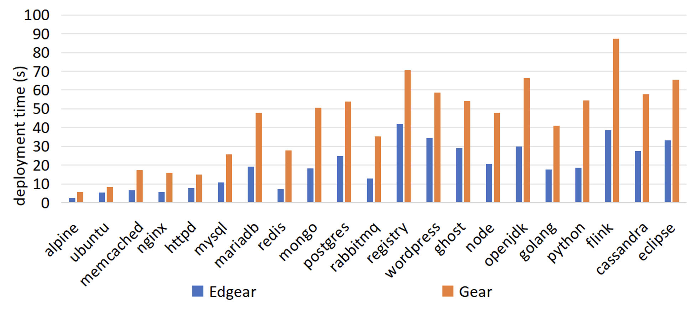
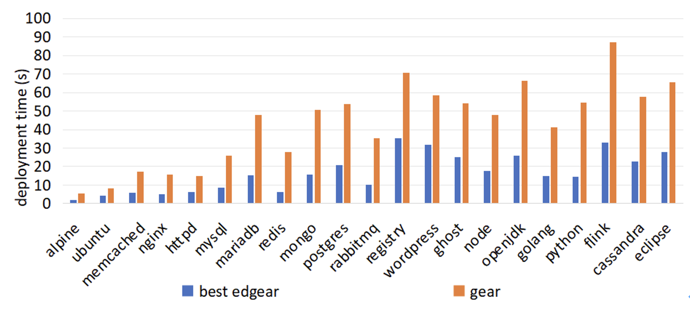
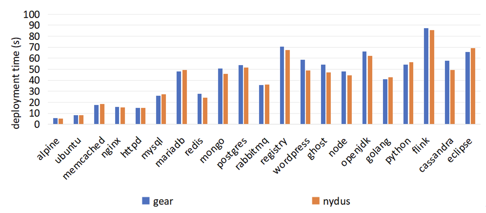

# Edgear: Efficient Container Deployment Framework Beyond the Cloud

## Reviewer 1 and 2

## Reviewer 2
### 1. Performance gain of Edgear
#### 1.1 Performance of each image

The performance improvement of each image ranges from **1.6X (ubuntu) to 3.8X (redis)**.

#### 1.2 Upper bound of performance gain

For Edgear, the performance gain is mainly due to reduced data downloading time. We assume that all files are available on the nearest ES (10ms RTT) and that eBPF acceleration is used. Compared to the situation where data are pulled from the registry (300ms RTT) and eBPF is not used, the deployment performance improvement for images is **1.8X (wordpress) to 4.4X (redis)**.

## Reviewer 2 and 5
### 1. Comparison between Gear and Nydus in terms of on-demand pulling

Gear and Nydus show similar performance. The bandwidth is 500MB. The images are pulled from the registry.

## Reviewer 4
### 1. The detailed time of different compositions of figure 2.

As the conventional image needs to download the entire image, the downloading time is long (24.07s for Nginx when RTT is 10 ms). As on-demand images download a file when it is required, the file amount that need to be downloaded is reduced. Therefore the time of downloading data is shorter (12.78s for Nginx when RTT is 10 ms). However, as the RTT increases the downloading time of on-demand images increase obviously, because of the continuous and long request from the network (25.84s for Nginx when RTT is 300 ms). Furthermore, on-demand images show longer running time due to the network redirection and IO redirection through FUSE.

### 2. Results with different random graph model. 

The results show similar trends under different random graph models.

## Reviewer 1 and 5
### 1. Images used for experiment.
Please refer to [image list](experimental-data/image-list.csv) and [image distribution](experimental-data/image-distribution.txt)
